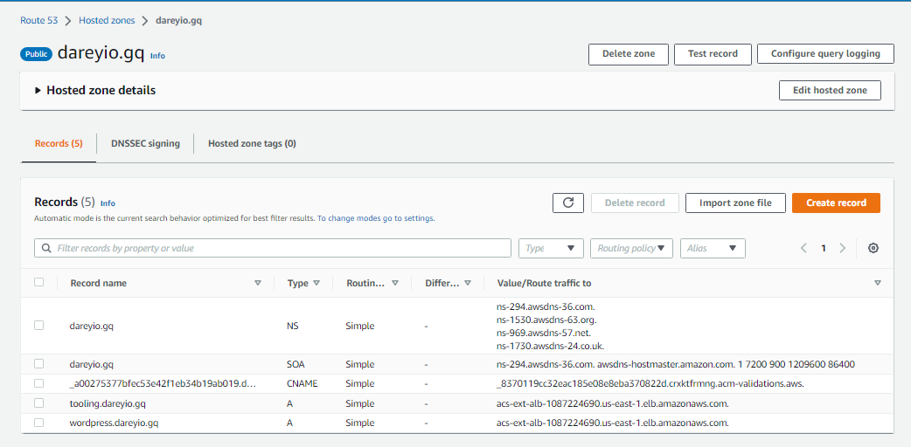
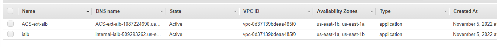
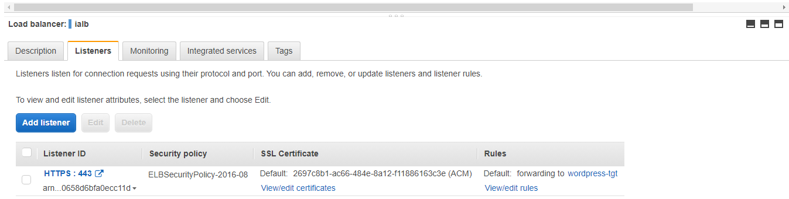
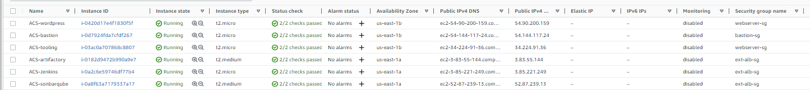

## DOCUMENTATION OF PROJECT 18
-

**AUTOMATE INFRASTRUCTURE WITH IAC USING TERRAFORM. PART 3 – REFACTORING**
-
**INTRODUCTION**
-

In two previous projects we developed AWS Infrastructure code using Terraform and tried to run it from the local workstation.
Now it is time to introduce some more advanced concepts in other to enhance our code. The first and major task is to explore alternative called Terraform backends. We will be doing a lot of refactoring in this project most importantly, we are inreoducing a new concept known as modules to tidy up our file structure. We will also reduce the hard coding drastically by declaring them as variables as this is best practice.

-----------
Before i introduced the backend on S3, we need to do some modifications to our hard coding used in the previous project, run `terraform` commands through modules and the aim is to arrive at the same end point we achieved in project 17.

 One more unique thing about this project is that we are moving all our commands from the local machine to public just in case other developers want to work on the same infrastructure we deployed. Let's take it a step at a time. 
Follow the procedures below. Please do note that you can decide to replicate the directory/folder you used in project 17 for peoject 18 just as i did. I named my working directory as `PBL-18`. 

The first approach was to `create a new folder and named it modules` and inside modules, i created 7 more folders namely `ALB`(For the application load balancer), `Autoscaling`, `compute`, `EFS`, `RDS`, `Security`, and `VPC`. The images needed for better understanding will be attached after this explanation.

After creating all these folders, i moved the relevant `.tf` files to their respective folders. I moved the `alb.tf`, `cert.tf`, `outputs.tf` files to the `ALB` folder then i created a new file and named it `variables.tf` since we are declaring most of the arguments in variables now. I configured all the files and moved to configuring the other folders. 

Inside the `main.tf`, i created two new files and named them `main.tf` and `variables.tf` accordingly. It was an optional task but i needed to do to acquire more knowledge. The task was to deploy 3 instances for SonarQube, Jenkins and Artifactory. Then i moved to the `EFS` folder and moved the `efs.tf` file there but added a new file named `variables.tf` and configured same accordingly. 

I proceeded to the `RDS` folder and did the samw thing. Moved the `rds.tf` file there and added a new file `variables.tf`. For the `VPC` folder, i moved the `internet-gw.tf`, `main.tf`(The `main.tf` we used in project 17), `nat-gw.tf`, created a new file and named it `outputs.tf`, moved the `roles.tf`, `routes.tf` and finally created a new file and named it `variables.tf`.

 I configured these files to the very standard required for our resources to be successfully deployed on aws and the moved to the `Autoscaling folder`. I introduced new approach, separated the launch templates codes from autoscaling codes for all the servers. So, inside the `autoscaling` folder, i have the `asg-bastion-nginx.tf`, `asg-webserver.tf`, `it-tooling-wp.tf`, `it-bastion-nginx.tf` and the `variables.tf` file. 
 
 Then i added their user data respectively. The `nginx.sh`, `wordpress.sh`, `bastion.sh` then i configured the codes respectively. In the Security folder, i moved the `security.tf` file there and added four more files namely `main.tf`, `outputs.tf`, `sg-rule.tf`, and `variables.tf`. 
 
 These were the  changes i made to my working directory. See the images below for a pictorial representation of the aforementioned. 

After complete configuration of all the files, i created another file outside the root module and named it `main.tf` to make terraform understand its job and connect to other folders in the `modules` directory. Inside the `main.tf`, i referenced all the folders and specifically asked terraform to create a new S3 bucket and Dynamod table for our backend codes.

 So i ensured terraform validates the modifications after initializing it then i proceeded to applying the changes. After a successful deployment of the resources to aws, i checked the console and all the resources were there. Check the images below:

 

 

 

 

 

 

 

 

 

 

 

 

 

 

 

 

 

 

 

 
 
 After confirming the successful deployment, i then configured the backend, initialized the process and deployed the `.terraform.tfstate` to the web through the s3 bucket. Check the images below:

 

 

 This brings us to the end of project 18 implementation. Thank you. 
 
 The next project will be another phase where we deploy all the infrastructures and ensure the websites is up and running.